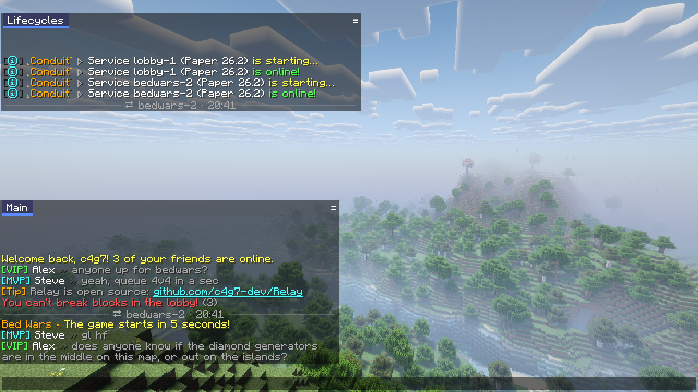
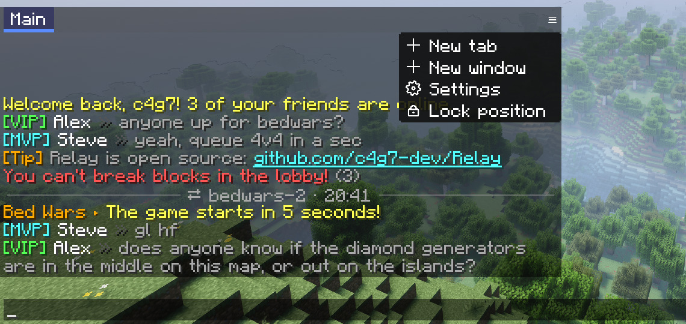
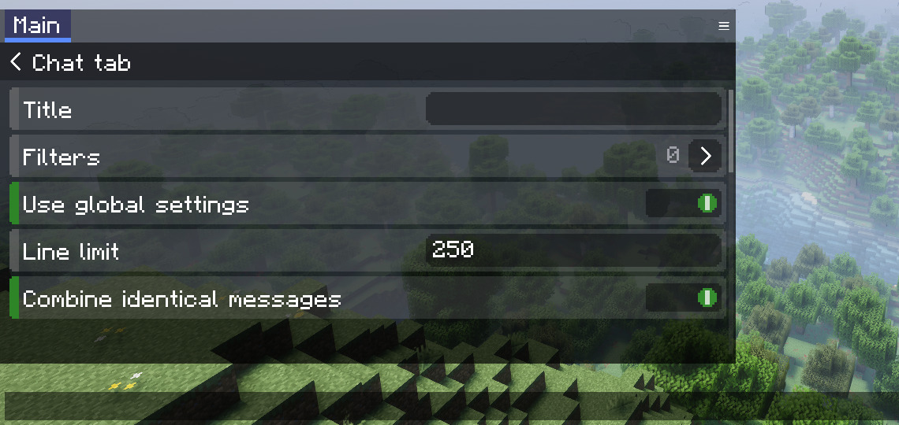
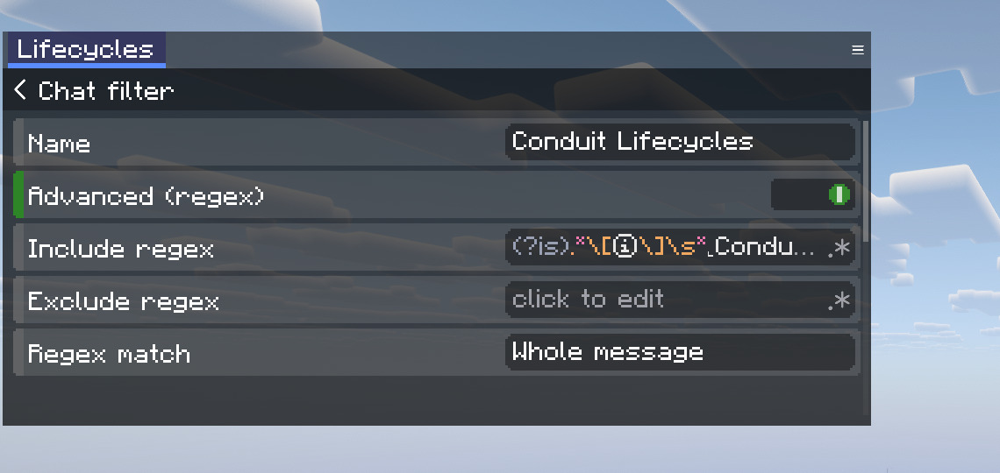
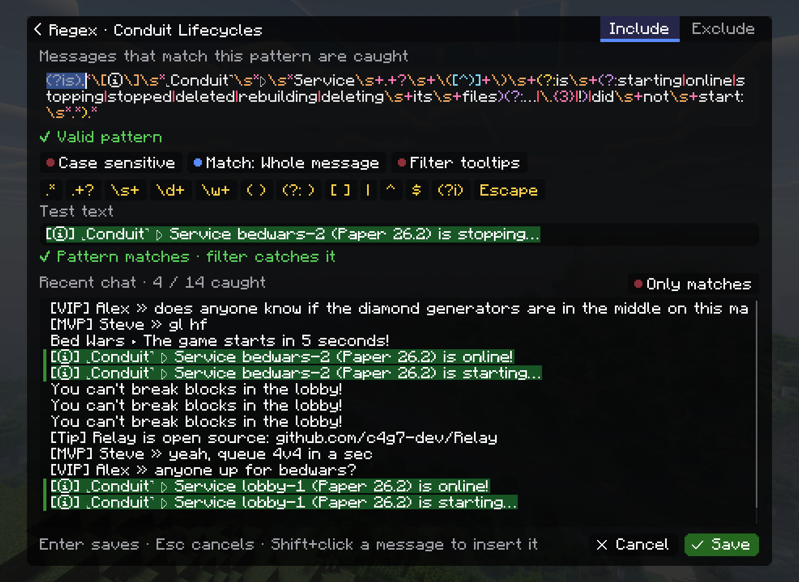

<p align="center">
  
</p>

<h1 align="center">Relay</h1>

<p align="center">
  <em>windowed chat for Minecraft: movable, lockable chat windows with tabs, regex filters and chat that survives server switches</em>
</p>

<p align="center">
  <a href="https://github.com/c4g7-dev/Relay/releases"></a>
  
  
  
  <a href="https://github.com/c4g7-dev/Relay/actions/workflows/build.yml"></a>
  <a href="LICENSE"></a>
</p>

<p align="center">
  
  <br>
  <sub>a <b>Main</b> window, and a <b>Lifecycles</b> window whose regex filter catches Conduit's server lifecycle messages · works on any server</sub>
</p>

<p align="center">
  <sub>made by <a href="https://github.com/c4g7-dev">c4g7</a></sub>
</p>

---

## what it does

- **chat windows**: as many as you like. Drag them by the tab bar, resize them from any edge, and they stay anchored to the nearest screen corner when the window or GUI scale changes
- **lock windows in place** from the ≡ menu or the tab settings. A locked window ignores drags and edge grabs and shows a small padlock
- **tabs** with unread markers. The **Main** tab gets everything; every other tab only gets what its filters catch
- **filters** by words or by **regex**, with *keep out of Main*, *hide*, *play sound*, *change background* and *search tooltips*
- **regex editor**: a full screen for writing patterns, with syntax colours, live validation that points at the error, snippet buttons, a test line and a live preview of which recent messages the filter would catch
- **real text fields** everywhere: click to place the caret, drag or Shift+arrows to select, double-click a word, triple-click for everything, Ctrl+A / C / X / V, Ctrl+←/→ word jumps, Ctrl+Backspace, Ctrl+Z / Ctrl+Y undo and redo
- **chat that survives server switches**: proxy moves (Velocity/Bungee) no longer wipe the windows, leaving a server keeps your tabs and your ↑ input history, and a thin `→ server · 14:32` divider marks where you landed. Optionally, the tabs are remembered across game restarts
- **clickable chat**: links, run/suggest-command, copy-to-clipboard and hover tooltips all work inside the windows, and Shift+click inserts a name
- timestamps, message markers, text shadow, per-tab background colours, combining of identical messages (`(3)`), anti-chat-clear, right-click to copy a message, vanilla's secure-chat indicator

It looks and feels exactly like VelvetChat, the mod it grew out of: same panels, colours, toggles and animations.

<p align="center">
  
  
  <br>
  <sub>the ≡ menu of a window · a tab's settings, right inside the window</sub>
</p>

## the regex editor

<p align="center">
  
</p>

Open it from a filter with *Advanced (regex)* on, by clicking *Include regex* or *Exclude regex*.

<p align="center">
  
</p>

- **Include / Exclude**: a message is caught when it matches *include* and not *exclude*
- **Match**: *Contains* finds the pattern anywhere; *Whole message* needs it to match the entire line (what VelvetChat always did)
- **snippets** insert common pieces or wrap the selection (`( )`, `(?: )`, `[ ]`), and **Escape** turns selected text into a literal
- **recent chat**: click a message to test it, Shift+click to insert it escaped into the pattern
- `Enter` saves, `Esc` cancels, `Tab` switches between pattern and test line

A pattern that backtracks catastrophically, such as `(?:.*,){12}X`, gives up after a few milliseconds per message instead of freezing the game.

## install

1. Install [Fabric Loader](https://fabricmc.net/use/) ≥ 0.19.5 and [Fabric API](https://modrinth.com/mod/fabric-api) for Minecraft 26.2
2. Drop `relay-<version>.jar` from the [releases](https://github.com/c4g7-dev/Relay/releases) into `mods/`

### coming from VelvetChat

Remove VelvetChat. Both replace the chat, so Fabric refuses to start with both installed. On first start Relay imports `config/velvetchat/chat.json`, so your windows, tabs and filters come straight over. Imported regex filters keep VelvetChat's *Whole message* matching.

One behaviour change: VelvetChat's regex *Case sensitive* toggle was inverted (on meant case-*in*sensitive). Relay does what the toggle says.

## keys & controls

| | |
|---|---|
| `M` | open the chat with the tab settings (rebindable: *Chat settings*) |
| drag the tab bar / body | move a window |
| drag an edge | resize |
| ≡ | new tab, new window, settings, lock / unlock, delete |
| right-click a message | copy it |
| mouse wheel | scroll (Shift: one line at a time) |
| `Esc` in settings | one page back |

## config

`config/relay/relay.json` holds everything and is safe to edit by hand. Colours are `#AARRGGBB`. If the file ever fails to parse, it is kept as `relay.json.broken` and Relay starts from defaults.

*Remember chat after restart* writes `config/relay/history.json` (the last 100 messages per tab). Turning the option off deletes that file.

## build

```sh
./gradlew build          # jar in build/libs/
./gradlew test           # unit tests: text editing, regex, filters, config import
./gradlew runSelftest    # dev client that clicks through the UI and takes screenshots
```

Needs JDK 25. `runSelftest` expects a world called `RelayTest` in `run-selftest/saves/` and runs fine headless: `tools/selftest.sh` starts it under `xvfb-run` with Mesa at 1920×1080 and prints the PASS/FAIL lines. The README shots come from that run, with Sodium, Iris and Complementary Reimagined dropped into `run-selftest/`.

## credits & license

Relay is made by [c4g7](https://github.com/c4g7-dev). Bugs and ideas go to the [issues](https://github.com/c4g7-dev/Relay/issues).

MIT, see [LICENSE](LICENSE). Relay is a clean rewrite: no VelvetChat code or assets are included, it only mirrors its look and behaviour.
